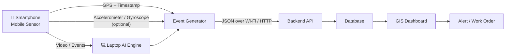

# Gartika — Prototype Product Requirements Document

## AI-Powered Mobile Urban Intelligence Platform Using Public Transport Fleet

> **Sense. Analyze. Predict. Act.**

- **Event:** Smart India Hackathon 2026
- **Problem Statement ID:** 26124
- **Theme:** Buses as Urban Sensors
- **PS Category:** Software
- **Team:** Tech Priests
- **Prototype Version:** 1.0
- **Updated:** September 8, 2026

---

## 1. Prototype Overview

Gartika is an AI-powered urban intelligence platform that turns a moving public-transport vehicle into a mobile urban sensing unit.

For the **working prototype**, the sensing device is intentionally simplified to a **smartphone**, while a **laptop acts as the central intelligence platform**.

The smartphone provides:

- Camera/video input
- GPS/location
- Timestamp
- Accelerometer/gyroscope data where available
- Network connectivity

The laptop provides:

- AI inference
- Object detection
- Object tracking
- Road-defect detection
- Event generation
- Backend/API
- Database
- GIS dashboard
- Alerts and maintenance workflow

This prototype validates the core Gartika concept without requiring the final production hardware.

### Prototype principle

```text
Phone as Mobile Sensor
        ↓
AI Detection
        ↓
Geotagged Event
        ↓
Backend
        ↓
GIS Dashboard
        ↓
Action / Work Order
```

The production architecture can later replace the smartphone with a dedicated Raspberry Pi 5 + Hailo-8 edge unit and external cameras/GPS/IMU sensors.

---

# 2. Problem Statement

Urban infrastructure monitoring commonly depends on fixed CCTV, manual surveys, citizen complaints, and delayed congestion reporting.

These approaches have limited road coverage and can delay the discovery and response to road defects and safety issues.

Gartika addresses this by using vehicles that already travel through the city as mobile sensing platforms.

The prototype demonstrates this idea at a small scale:

> **A phone mounted on a moving vehicle observes the road, AI identifies an urban event, location is attached to that event, and the laptop displays it on a city map for action.**

---

# 3. Prototype Goals

The prototype has the following goals:

1. Demonstrate a mobile vehicle acting as an urban sensor.
2. Capture road/traffic video using a smartphone.
3. Detect vehicles using AI.
4. Track detected vehicles across frames.
5. Detect potholes/road defects using an AI model or prototype detection pipeline.
6. Obtain GPS coordinates and timestamps from the mobile sensing unit.
7. Generate structured geotagged events.
8. Send events from the mobile unit to the laptop.
9. Store events in a backend database.
10. Display detected events on a GIS-style dashboard.
11. Generate an actionable maintenance/work-order record.
12. Demonstrate the separation between sensing/edge functions and centralized urban intelligence.
13. Demonstrate that only structured events need to be transmitted rather than continuous raw video.

---

# 4. Prototype Scope

## 4.1 In Scope

### Mobile sensing unit

- Smartphone camera
- Smartphone GPS
- Smartphone timestamp
- Smartphone accelerometer/gyroscope where accessible
- Smartphone network/Wi-Fi connectivity
- Bus/vehicle identifier

### AI

- Vehicle detection
- Vehicle tracking
- Basic road-defect/pothole detection
- Detection confidence
- Optional traffic vehicle counting

### Event generation

Each important detection should become a structured event containing:

- Event ID
- Vehicle/bus ID
- Event type
- Confidence
- Latitude
- Longitude
- Timestamp
- Severity
- Optional evidence image/short clip reference

### Backend

- Event ingestion API
- Event storage
- Bus/device status
- Event retrieval
- Work-order creation

### Dashboard

- Map
- Bus/device location
- Detected events
- Event severity
- Confidence
- Event details
- Work-order action

---

# 5. Out of Scope for the Prototype

The following are deliberately excluded from the Sunday/demo prototype:

- Four-camera production setup
- Raspberry Pi 5 deployment
- Hailo-8 accelerator deployment
- External GPS module
- External IMU module
- 4G/5G modem
- Rugged IP66 enclosure
- Automotive DC-DC power system
- Supercapacitor UPS
- Continuous cloud video streaming
- Full ANPR system
- Full pedestrian safety pipeline
- Full infrastructure monitoring pipeline
- Full congestion modeling
- Kafka/Flink/Spark production deployment
- Kubernetes
- Production municipal integrations
- Autonomous traffic challans
- Production-grade chain-of-custody
- Fleet-scale deployment

These remain part of the longer-term Gartika architecture.

---

# 6. Prototype Architecture



## 6.1 Prototype data flow

```text
Smartphone Camera
      ↓
Video Frames
      ↓
AI Detection
      ↓
Vehicle Tracking / Road Defect Detection
      ↓
GPS + Timestamp
      ↓
Structured Event
      ↓
HTTP / WebSocket / Local Network
      ↓
Backend API
      ↓
Database
      ↓
GIS Dashboard
      ↓
Alert
      ↓
Create Work Order
```

---

# 7. Smartphone — Mobile Sensor Unit

The smartphone acts as a temporary prototype for the production onboard edge unit.

## 7.1 Smartphone responsibilities

| Function | Prototype implementation |
|---|---|
| Camera | Smartphone camera |
| GPS | Smartphone GPS |
| Timestamp | Smartphone system time |
| IMU | Built-in accelerometer/gyroscope where accessible |
| Connectivity | Wi-Fi / phone hotspot |
| Device ID | Configured bus/device ID |
| Evidence | Captured image or short video reference |

## 7.2 Smartphone placement

The phone should be mounted facing the road, preferably near the front of the vehicle.

The demonstration should make the physical relationship clear:

```text
           ROAD
────────────────────────
        ↓ Camera
      ┌───────┐
      │ PHONE │
      │GARTIKA│
      └───────┘
        VEHICLE
```

The phone represents the sensing unit installed on a public bus.

---

# 8. Laptop — Central Intelligence Platform

The laptop is responsible for the computationally heavier prototype components.

## 8.1 Laptop responsibilities

- Receive camera/video data or event data
- Run AI inference
- Run object tracking
- Run road-defect detection
- Generate structured events
- Host backend API
- Store events
- Serve the dashboard
- Display GIS information
- Trigger alerts
- Create work orders

## 8.2 Prototype stack

### AI

- YOLOv8
- ByteTrack
- Road-defect/pothole model

### Backend

- Python
- FastAPI
- REST API
- WebSocket where useful

### Database

For a lightweight prototype:

- SQLite, or
- PostgreSQL/PostGIS if already available

### Frontend

- React/Next.js or a lightweight web dashboard
- Map-based visualization
- Real-time event updates where practical

---

# 9. AI Pipelines

The full Gartika concept contains six AI sensing pipelines:

1. Road defects
2. Infrastructure monitoring
3. Traffic density
4. Congestion analysis
5. Pedestrian safety
6. Incident & ANPR

The prototype focuses on the **two most important demonstrable pipelines**.

## 9.1 Pipeline A — Vehicle Detection & Tracking

```text
Camera Frame
     ↓
YOLOv8
     ↓
Vehicle Detection
     ↓
ByteTrack
     ↓
Persistent Track IDs
     ↓
Vehicle Count
```

Example:

```text
CAR #01
CAR #02
BIKE #03
BUS #04
```

The tracking layer prevents the same vehicle from being counted as a new vehicle in every frame.

## 9.2 Pipeline B — Road Defect Detection

```text
Camera Frame
     ↓
Pothole / Road Defect Model
     ↓
Confidence Score
     ↓
Optional IMU Validation
     ↓
Geotagged Event
```

Example:

```text
POTHOLE DETECTED
Confidence: 91%
Location: 12.xxxx, 77.xxxx
Bus: BUS-101
Severity: HIGH
```

---

# 10. Optional Sensor Fusion

One of Gartika's key innovations is combining visual detection with physical vehicle vibration.

For the prototype, the smartphone's built-in accelerometer can be used if accessible.

```text
        Camera
          ↓
   Pothole Detection
          +
   Accelerometer
          ↓
   Vibration Evidence
          ↓
   Confidence Boost
          ↓
  Confirmed Road Event
```

This is a prototype demonstration of the production concept.

The production system is intended to use dedicated IMU hardware for more controlled measurements.

---

# 11. Event Model

All important detections should be converted into structured events.

## 11.1 Example event

```json
{
  "event_id": "EVT-001",
  "bus_id": "BUS-101",
  "event_type": "POTHOLE",
  "confidence": 0.91,
  "latitude": 12.9716,
  "longitude": 77.5946,
  "timestamp": "2026-09-08T10:32:21",
  "severity": "HIGH"
}
```

## 11.2 Vehicle event

```json
{
  "event_id": "EVT-002",
  "bus_id": "BUS-101",
  "event_type": "VEHICLE_COUNT",
  "vehicle_class": "CAR",
  "count": 14,
  "latitude": 12.9716,
  "longitude": 77.5946,
  "timestamp": "2026-09-08T10:32:30"
}
```

---

# 12. Backend API

The prototype backend should expose the following minimum APIs.

| Method | Endpoint | Purpose |
|---|---|---|
| POST | `/events` | Submit a detected event |
| GET | `/events` | Retrieve events |
| GET | `/events/{id}` | Retrieve a specific event |
| GET | `/buses` | Retrieve active buses/devices |
| POST | `/work-orders` | Create a maintenance work order |
| GET | `/work-orders` | Retrieve work orders |

Optional:

| Method | Endpoint | Purpose |
|---|---|---|
| GET | `/health` | Backend health |
| GET | `/stats` | Dashboard statistics |
| WS | `/ws/events` | Real-time event updates |

---

# 13. GIS Dashboard

The dashboard is the main visual component of the prototype.

## 13.1 Dashboard layout

```text
┌─────────────────────────────────────────────────────┐
│                    GARTIKA                           │
│       AI-Powered Urban Intelligence Platform        │
├──────────────┬──────────────────────────────────────┤
│ BUS STATUS   │                                      │
│              │             GIS MAP                  │
│ BUS-101      │                                      │
│ ● ACTIVE     │       🔵 Bus                         │
│              │       🔴 Pothole                    │
│ Events: 12   │       🟡 Traffic                    │
│              │                                      │
├──────────────┴──────────────────────────────────────┤
│ Recent Events                                       │
│                                                    │
│ 🚨 POTHOLE   HIGH   91%   BUS-101                  │
│ 🚗 TRAFFIC   MED    --    BUS-101                  │
└─────────────────────────────────────────────────────┘
```

## 13.2 Map features

The map should display:

- Current bus/device location
- Pothole markers
- Road-defect markers
- Traffic markers
- Event severity
- Event details
- Detection time
- Confidence
- Work-order status

---

# 14. Maintenance Workflow

The prototype should demonstrate that Gartika does not stop at detection.

```text
AI Detection
     ↓
Geotagged Event
     ↓
Dashboard Alert
     ↓
Authority Reviews Event
     ↓
Create Work Order
     ↓
Maintenance Status
```

Example:

```text
┌──────────────────────────────┐
│ 🚨 HIGH PRIORITY ROAD DEFECT │
├──────────────────────────────┤
│ Type: Pothole                │
│ Confidence: 91%              │
│ Bus: BUS-101                 │
│ Location: MG Road            │
│ Time: 10:32 AM               │
│                              │
│ [ CREATE WORK ORDER ]        │
└──────────────────────────────┘
```

After creation:

```text
✓ WORK ORDER CREATED

Issue: Pothole
Priority: HIGH
Source: BUS-101
Status: Assigned
```

---

# 15. Communication Architecture

For the prototype, phone and laptop can communicate over:

- Same Wi-Fi network
- Smartphone hotspot
- Local HTTP
- WebSocket for live events

The prototype should prioritize reliability over cellular realism.

## Prototype

```text
PHONE
  │
  │ Wi-Fi / Hotspot
  ↓
LAPTOP
```

## Production

```text
BUS EDGE UNIT
      │
      │ MQTT / HTTPS
      ↓
CELLULAR NETWORK
      │
      ↓
CLOUD PLATFORM
```

---

# 16. Edge vs Cloud Concept

The physical prototype uses a phone and laptop, but it should still demonstrate Gartika's intended logical separation.

### Prototype sensing layer

```text
PHONE
Camera
GPS
IMU
Device identity
```

### Prototype intelligence layer

```text
LAPTOP
AI
Tracking
Event processing
Database
GIS
Alerts
```

### Production architecture

```text
BUS
 └── Edge AI Unit
      ├── Cameras
      ├── GPS
      ├── IMU
      ├── YOLOv8
      ├── ByteTrack
      └── Local evidence storage
              │
              ↓
          Cloud Tier
              ├── Ingestion
              ├── Database
              ├── Analytics
              ├── GIS
              └── Alerts
```

---

# 17. Bandwidth Strategy

A major Gartika principle is to avoid continuously transmitting raw video.

The prototype should demonstrate this concept by sending **structured JSON events** to the laptop instead of treating the laptop as a continuous video-storage destination.

Example:

```text
RAW VIDEO
████████████████████████████████████

              VS.

STRUCTURED EVENT
{
  "type": "POTHOLE",
  "confidence": 0.91,
  "lat": 12.xxxx,
  "lon": 77.xxxx
}
```

The original Gartika PRD estimates approximately **144 GB/bus/day** for continuous raw video versus approximately **0.035 GB/bus/day** for edge event telemetry under its stated assumptions. These figures are design estimates, not measurements from this prototype.

---

# 18. Privacy

The prototype should follow the same privacy principle as the production design:

> Process locally where practical and avoid unnecessary transmission of personally identifying information.

For the demonstration:

- Do not intentionally identify passengers.
- Do not store unnecessary personal information.
- Blur faces/plates if evidence is displayed publicly.
- Use synthetic/demo data where possible.
- Keep raw demonstration footage local.

Production Gartika is intended to apply edge anonymization before clips/crops leave the vehicle.

---

# 19. Prototype Hardware

## Minimum

| Component | Purpose |
|---|---|
| Smartphone | Camera + GPS + optional IMU |
| Laptop | AI + backend + dashboard |
| Phone mount | Simulate bus-mounted sensor |
| Wi-Fi / hotspot | Phone-to-laptop communication |
| Laptop power | Prototype operation |

No dedicated Raspberry Pi, Hailo-8, external GPS or external IMU is required for the basic prototype.

## Future production hardware

```text
Raspberry Pi 5 8GB
+
Hailo-8 AI Accelerator
+
Cameras
+
GPS
+
IMU
+
Local Storage
+
4G/5G
+
Ruggedized Power/Enclosure
```

The official Gartika architecture specifies Raspberry Pi 5 + Hailo-8, cameras, and GPS/IMU for the onboard production unit.

---

# 20. Prototype Demonstration Scenario

The demonstration should follow one complete end-to-end story.

## Step 1 — Start Gartika

Laptop dashboard opens.

```text
GARTIKA COMMAND CENTER
BUS-101: OFFLINE
```

## Step 2 — Activate mobile sensor

Start the smartphone sensing application.

```text
BUS-101
● CAMERA ACTIVE
● GPS ACTIVE
● NETWORK ACTIVE
```

Dashboard changes:

```text
BUS-101: ONLINE
```

## Step 3 — Vehicle detection

Point the phone at road traffic.

Laptop displays:

```text
CAR #01
CAR #02
BIKE #03
BUS #04
```

## Step 4 — Pothole detection

A pothole appears in the demonstration video.

AI produces:

```text
🚨 POTHOLE DETECTED
Confidence: 91%
```

## Step 5 — Geotag event

The system attaches:

```text
BUS-101
GPS
Timestamp
Confidence
Severity
```

## Step 6 — Send event

```text
PHONE
   ↓
JSON EVENT
   ↓
LAPTOP BACKEND
```

## Step 7 — Map update

A red marker appears on the GIS map.

```text
🔴 POTHOLE
```

## Step 8 — Action

Open the event and select:

```text
CREATE WORK ORDER
```

## Step 9 — Completion

```text
✓ Maintenance request created
Priority: HIGH
Status: ASSIGNED
```

---

# 21. Demo Success Criteria

The prototype is considered successful if it can demonstrate at least one complete path:

```text
Camera
  ↓
AI
  ↓
Detection
  ↓
GPS + Timestamp
  ↓
Structured Event
  ↓
Backend
  ↓
Database
  ↓
GIS Map
  ↓
Alert
  ↓
Work Order
```

### Minimum success criteria

- Smartphone successfully acts as the mobile sensing unit.
- Vehicle detection works on demonstration footage.
- At least one road-defect event can be generated.
- Event contains location and timestamp.
- Backend receives the event.
- Event appears on the map.
- User can open the event.
- User can create a work order.
- End-to-end demo can be completed reliably.

---

# 22. Production Roadmap

The smartphone/laptop prototype is not a replacement for the intended production architecture. It is the first proof of the concept.

## Phase 0 — Demonstration Prototype

**Phone + Laptop**

- Camera
- GPS
- Vehicle detection
- Vehicle tracking
- Pothole detection
- Event API
- GIS map
- Work order

## Phase 1 — Edge Hardware Proof of Concept

**Raspberry Pi 5 + Hailo-8**

- 2 cameras
- Pothole detection
- Vehicle detection
- MQTT
- Simple map
- Local evidence storage

The original PRD defines this as the first formal deployment phase.

## Phase 2 — Enhanced Detection

**20 buses**

- 4-camera configuration
- Infrastructure detection
- Waterlogging
- Pedestrian safety
- Basic ANPR
- GIS heatmaps
- Maintenance-ticket integration

## Phase 3 — Full Platform

**100+ buses**

- Full sensor suite
- Incident detection
- ANPR
- OD modeling
- Predictive maintenance
- Police/traffic-center integration
- Fleet-wide analytics

---

# 23. Final Prototype Positioning

The prototype should be presented as:

> **“A smartphone-based proof of concept for Gartika's mobile urban sensing architecture.”**

The smartphone is the temporary sensor node.

The laptop is the prototype urban intelligence center.

The important achievement is not the specific hardware. It is proving the complete chain:

```text
SENSE
  ↓
ANALYZE
  ↓
GEOTAG
  ↓
TRANSMIT
  ↓
VISUALIZE
  ↓
ACT
```

That validates the central Gartika idea:

> **Turn every moving public-transport vehicle into a mobile urban sensor and convert its observations into actionable city intelligence.**
