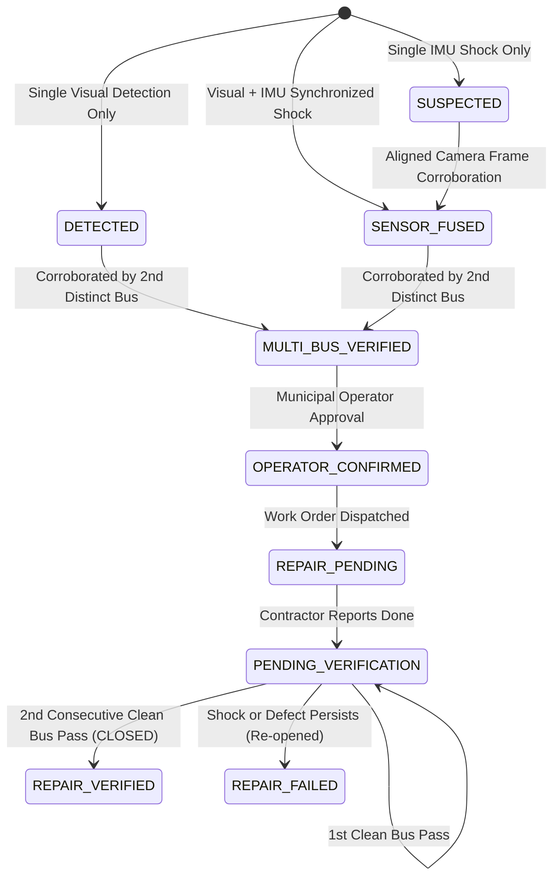

# Multi-Modal Sensor Fusion & Verification in Gartika

Gartika combines optical computer vision (YOLOv8 + OpenCV contour heuristics), 6-axis inertial measurement unit (IMU) accelerometer signals, and high-precision GNSS/GPS telemetry to detect, categorize, corroborate, and audit road surface distress.

---

## 1. Mathematical Principles & Fusion Pipeline

### 1.1 Dynamic Baseline Gravity Calibration
Due to vehicle suspension loading, road slope, or smartphone mount orientation, baseline gravitational acceleration on the Z-axis is not always exactly 9.81 m/s². 
The `SensorBufferManager` maintains a dynamic running average of vertical baseline gravity:
27261\bar{g}_{k} = \bar{g}_{k-1} + \alpha \cdot (a_{z,k} - \bar{g}_{k-1})27261
where $\alpha = 0.05$. Vertical shock magnitude is dynamically computed as:
27261\text{shock\_magnitude} = |a_{z} - \bar{g}|27261

### 1.2 Temporal Window Alignment (±500ms - 800ms)
Camera frames (15–30 FPS) and IMU readings (10–100 Hz) run on separate clocks. When a visual defect candidate is registered at timestamp {\text{frame}}$, the fusion engine scans the vehicle's isolated ring buffer for the IMU reading with:
27261\Delta t = |t_{\text{imu}} - t_{\text{frame}}| \le \Delta t_{\text{max}} \quad (\text{default: } 800\text{ ms})27261

---

## 2. Transparent Confidence Score Breakdown

Gartika explicitly distinguishes between model confidence, visual heuristic scores, mechanical shock scores, and fusion scores. It never claims uncorroborated detections as ground truth.

| Field | Description | Range | Source |
|---|---|---|---|
| `model_confidence` | Raw confidence output from YOLOv8 neural network | 0.0 - 1.0 (or null) | ultralytics YOLO |
| `heuristic_score` | Dark patch contour & texture variance metric | 0.0 - 1.0 (or null) | OpenCV morphological pipeline |
| `imu_score` | Calibrated vertical shock impact score | 0.0 - 1.0 (or null) | IMU accelerometer $ |
| `fusion_score` | Weighted multi-modal fused score | 0.0 - 1.0 | SensorFusionEngine |
| `verification_score`| Fleet corroboration confidence | 0.0 - 1.0 | Multi-bus aggregation count |
| `final_confidence` | Composite system confidence | 0.0 - 1.0 | Fused composite |

---

## 3. Defect Lifecycle & Multi-Bus Corroboration

---

## 4. Closed-Loop Repair Verification Engine

When a defect is flagged as `REPAIRED` by municipal crews:
1. Returning fleet buses traverse within 15m of the recorded coordinates.
2. If the bus records **no visual pothole** and **smooth IMU baseline** ( \approx 9.8\text{ m/s}^2$), a clean verification observation is recorded.
3. Once `REPAIR_VERIFICATION_CLEAN_COUNT` (configurable, default: 2) consecutive clean passes are completed:
   - Defect status transitions to `CLOSED`.
   - `repair_status` transitions to `REPAIR_VERIFIED`.
   - Associated `WorkOrder` transitions to `RESOLVED`.
4. If a shock or visual defect is detected during traversal, status transitions to `REPAIR_FAILED`, alerting supervisors immediately.
