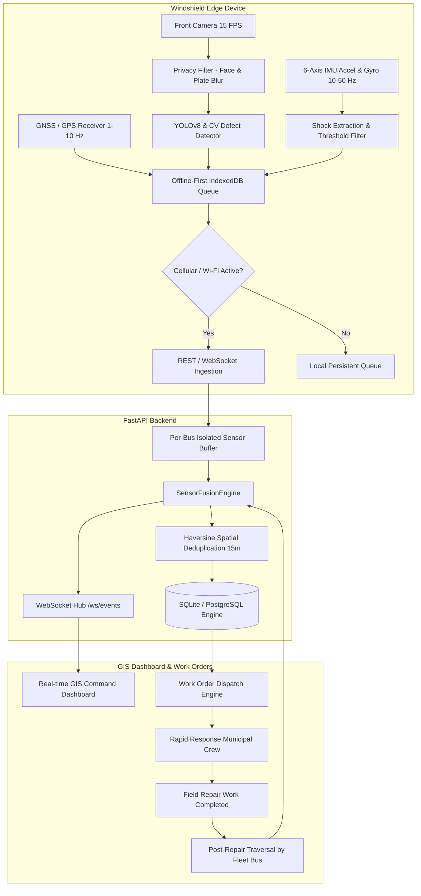
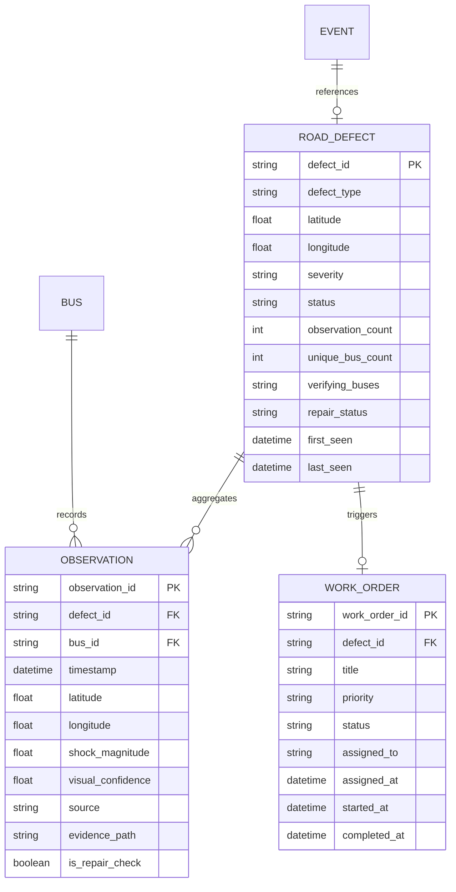
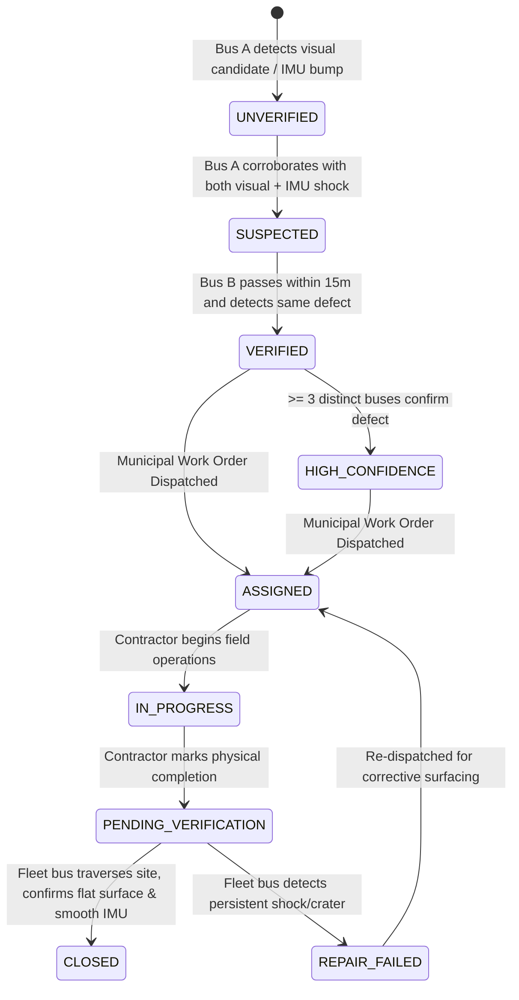

# Gartika System Architecture & Deep Technical Design

## 1. System Philosophy & Objectives
Gartika is an autonomous, privacy-preserving, edge-fused urban road distress and traffic intelligence platform that leverages regular transit buses as continuous civic scanning units.

Rather than streaming continuous raw high-definition video over public cellular infrastructure, Gartika performs:
1. **Edge Computer Vision & Mechanical Shock Detection**: High-frequency IMU and camera frames are aligned in temporal buffers per vehicle.
2. **Multi-Modal Sensor Fusion**: Visual pothole detections are correlated with IMU accelerometer spikes ($|a_z - 9.81\text{ m/s}^2| > 3.2\text{ m/s}^2$) within a $\pm 500\text{ms}$ temporal alignment window.
3. **Spatial Deduplication & Aggregation**: Transient observations are deduplicated within a 15-meter Haversine spatial radius to form persistent `RoadDefect` entities.
4. **Multi-Bus Verification Lifecycle**: Defect confidence is graduated progressively from `UNVERIFIED` / `SUSPECTED` to `VERIFIED` and `HIGH_CONFIDENCE` when corroborated by distinct fleet buses.
5. **Closed-Loop Repair Auditing**: When municipal road maintenance completes a work order, returning fleet buses automatically verify whether the defect has been properly surfaced and smoothed.

---

## 2. Multi-Modal Sensor Fusion Engine

### Temporal Windowing & Alignment
Camera frame capture rates (10–30 FPS) and IMU sampling frequencies (10–100 Hz) run on separate asynchronous threads. The `SensorBufferManager` maintains individual circular ring buffers per registered `bus_id`.

When a visual candidate is detected at $t_{\text{frame}}$, the engine searches the IMU circular buffer for readings where:
$$|t_{\text{imu}} - t_{\text{frame}}| \le \Delta t_{\text{window}} \quad (\text{default: } 500\text{ ms})$$

### Multi-Modal Scoring Rules
1. **Corroborated Defect (Visual + IMU Shock)**:
   - High visual confidence ($\ge 0.70$) + vertical shock ($|a_z - 9.81| > 3.2\text{ m/s}^2$):
   $$\text{Final Confidence} = \min(0.98, \text{Visual Conf} \times 0.65 + \text{Shock Score} \times 0.35 + 0.10)$$
2. **Visual Only (No IMU Shock)**:
   - Defect detected visually but no vehicle shock felt (vehicle swerved or defect is shallow):
   $$\text{Final Confidence} = \text{Visual Conf} \times 0.85$$
3. **IMU Shock Only (No Aligned Visual Candidate)**:
   - Physical bump detected without confirmed visual crater:
   - Classified strictly as intermediate `ROAD_IMPACT` ($C \approx 0.65 - 0.85$), avoiding false positive overclaims.

---

## 3. Persistent Defect vs. Transient Observation Data Model

To prevent redundant tickets and maintain complete audit history, Gartika enforces strict architectural separation between **Physical Road Defects** and **Individual Bus Observations**:

---

## 4. Multi-Bus Verification State Machine

---

## 5. Bandwidth & Scaling Analysis

Continuous video streaming consumes massive data budgets that render fleet-wide deployments cost-prohibitive. By performing edge inference and transmitting only structured metadata and event crops:

$$\text{Raw Video Bitrate} = W \times H \times \text{bpp} \times \text{FPS} \approx 6.91\text{ Mbps per bus}$$
$$\text{Gartika Edge Bitrate} = \text{Telemetry Rate} + \text{Defect Rate} \approx 20.04\text{ Kbps per bus}$$

**Total Fleet Bandwidth Reduction: 99.71% (344.9x efficiency multiplier)**
